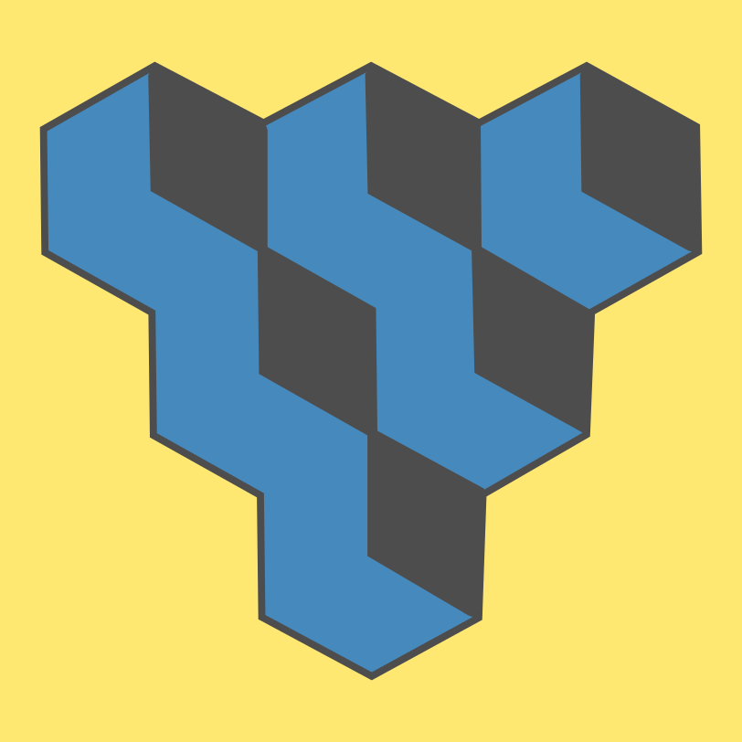
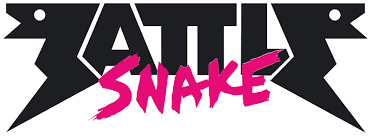

# Introducción a Python

## Semana 17
<!-- .element style="text-align:center" -->

 <!-- .element style="margin-left: auto; margin-right: auto; display: block; width: 200px;" -->

---

 <!-- .element style="margin-left: auto; margin-right: auto; display: block; width: 100%;" -->

---

 <!-- .element style="margin-left: auto; margin-right: auto; display: block" -->

---

# ¡BattleSnake!

 <!-- .element style="margin-left: auto; margin-right: auto; display: block" -->

### Cómo funciona

- El servidor de BattleSnake envía información sobre el estado del juego
- El bot debe responder con la dirección en la que se moverá
- Tú tienes que programar el bot
<br/><br/>

##### Enlaces:

- BattleSnake: [play.battlesnake.com](https://play.battlesnake.com/)
- Servidor AVAST: [battlesnake-avast.fly.dev](https://battlesnake-avast.fly.dev/)
- Editor de código: [pythonandturtle.com](https://pythonandturtle.com/)

---

# Proceso para jugar

1) Registrarse en [BattleSnake](https://play.battlesnake.com/)
2) Entrar en el [servidor de AVAST](https://battlesnake-avast.fly.dev/) con un usuario:
   - ¡NO REPITAS EL USUARIO!
   - Ojo porque se puede perder el código
3) Crear un bot en BattleSnake
4) Crear una partida
5) Refinar el bot y crear más partidas

---

# Ejemplo jugada BattleSnake

```json
{
  "game": {
    "id": "game-id-string"
  },
  "turn": 4,
  "board": {
    "height": 15,
    "width": 15,
    "food": [
      {"x": 1, "y": 3},
      {"x": 1, "y": 5},
      {"x": 3, "y": 1}
    ],
    "snakes": [
      {
        "id": "snake-id-string",
        "name": "Sneky Snek",
        "health": 90,
        "body": [{"x": 1, "y": 3}, {"x": 1, "y": 4}, {"x": 1, "y": 5}]
      }
    ]
  },
  "you": {
    "id": "snake-id-string",
    "name": "Sneky Snek",
    "health": 90,
    "body": [{"x": 1, "y": 3}, {"x": 1, "y": 4}, {"x": 1, "y": 5}]
  }
}
```

---

# Esto qué e lo que e?

- JSON (JavaScript Object Notation)
- Se accede a las partes con `data["board"]`
- Se pueden anidar las llamadas: `data["you"]["body"]`,
- Se acceden a las partes de las listas con índices: `data["you"]["body"][0]`

```json
{
  "game": {
    "id": "game-id-string"
  },
  "turn": 4,
  "board": {
    "height": 15,
    "width": 15,
    "food": [
      {"x": 1, "y": 3},
      {"x": 1, "y": 5},
      {"x": 3, "y": 1}
    ],
  },
  "you": {
    "id": "snake-id-string",
    "name": "Sneky Snek",
    "health": 90,
    "body": [{"x": 1, "y": 3}, {"x": 1, "y": 4}, {"x": 1, "y": 5}]
  }
}
```

---

# Código para probar

Editor de código: [pythonandturtle.com](https://pythonandturtle.com/)

```python
def move(data):
  # Tu codigo aqui
  # Debes devolver "up", "down", "left" o "right"

  board = data["board"]
  you = data["you"]

  return "left"


data = {
    "board": {},
    "you": {}
}


print(move(data))
```

---

# Instrucciones básicas de python

##### Condicionales

```python
if a > 1:
    secuencia_instrucciones_1
elif a == 1:
    secuencia_instrucciones_2
elif a == 0:
    secuencia_instrucciones_3
else:
    secuencia_instrucciones_4
```

##### Bucles

```python
for i in range(10):
    secuencia_instrucciones_1
```

---

# ¡A programar!

Objetivo: dar vueltas alrededor del tablero

- ¿Cómo puedes saber en qué dirección vas?
- ¿Cómo puedes saber si hay una pared?

---

# Ejemplo

```python
data = {
  "game": { },
  "turn": 3,
  "board": { "height": 11, "width": 11 }, # ...
  "you": {
    # ...
    "body": [
      { "x": 3, "y": 6 },
      { "x": 3, "y": 5 },
      { "x": 2, "y": 5 }
    ],
    "head": { "x": 3, "y": 6 },
    "length": 3,
    # ...
  }
}

# Calculamos la dirección de la serpiente
def direccion(data):
    # Obtenemos la posición de la cabeza y la cola
    cabeza = data["you"]["head"]
    siguiente = data["you"]["body"][1]

    # Calculamos la dirección de la serpiente
    if cabeza["x"] > siguiente["x"]:
        return "left"
    if cabeza["x"] < siguiente["x"]:
        return "right"
    if cabeza["y"] > siguiente["y"]:
        return "up"
    return "down"
```

