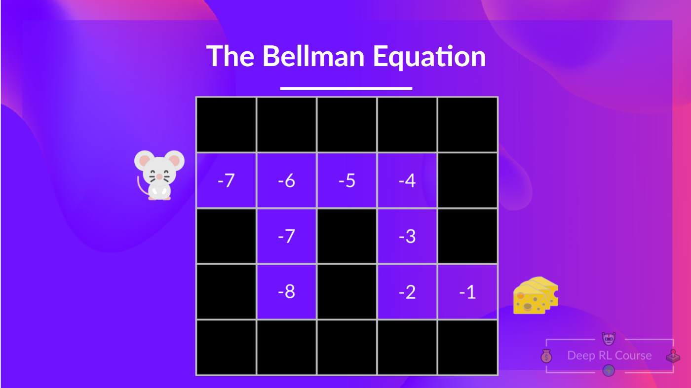
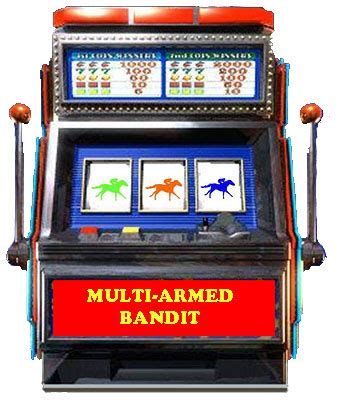
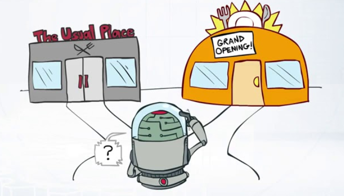

# Introducción a Python

## Semana 18
<!-- .element style="text-align:center" -->

 <!-- .element style="margin-left: auto; margin-right: auto; display: block; width: 200px;" -->

---

# Agentes inteligentes

#### El problema real: <!-- .element style="text-align:center" -->

 <!-- .element style="margin-left: auto; margin-right: auto; display: block; width: 50%;" -->

- Encontrar el valor de cada estado
- Según el valor de cada estado, aplicaremos una política
- El estado depende de la política

---

# El bandido de múltiples brazos

 <!-- .element style="margin-left: auto; margin-right: auto; display: block; width: 50%;" --> <!-- .element: class="fragment" -->

<ul>
<li>Objetivo: ganar lo más posible</li>
<li>Sólo hay un estado, no hay una secuencia</li>
<li>El valor de cada estado no depende de la política</li>
</ul> <!-- .element: class="fragment" -->

---

# Exploración vs Explotación

 <!-- .element style="margin-left: auto; margin-right: auto; display: block; width: 50%;" -->

- La **exploración** se utiliza para aumentar el conocimiento sobre un entorno o modelo
- La **explotación** se utiliza para aprovechar el conocimiento actual para maximizar la recompensa
- Si siempre explotamos, no descubriremos nuevas opciones
- Si siempre exploramos, no aprovecharemos las opciones conocidas
- Hay que encontrar un equilibrio

---

### Q-Learning

##### Conceptos
1. **Q-Value (Action-Value)**: Representa el valor de un estado bajo la política actual.
2. **Política**: Qué acción tomar en un estado dado.
3. **Tasa de aprendizaje (α)**: Determina el grado en que la nueva información reemplaza la información antigua. Varía entre 0 y 1.

---
### Q-Learning

##### Algoritmo:
1. **Inicializar la Tabla Q**: Una tabla donde las filas representan estados y las columnas representan acciones, inicializada a cero o valores aleatorios.
2. **Repetir (para cada episodio)**:
   - **Observar el estado actual (s)**.
   - **Elegir una acción (a)**: A menudo usando una política epsilon-greedy donde el agente principalmente elige la acción con el valor Q más alto, pero ocasionalmente explora acciones aleatorias.
   - **Realizar la acción (a)** y observar la recompensa (r) y el siguiente estado (s').
   - **Actualizar el valor Q**: Q(s) = Q(s) + α * ( Q(s') - Q(s) )
3. **Repetir hasta la convergencia**: Continuar el proceso hasta que los valores Q converjan a valores estables.

[Más información](https://www.datacamp.com/tutorial/introduction-q-learning-beginner-tutorial)

---

# Implementa Q-Learning

```python
import random

def multi_armed_bandit(lllIlllIllllIIllll):
    lIIIllllIIIIllllIl = [lambda : 2 * random.random() + 1, lambda : 3 * random.random() + 2, lambda : random.gauss(1, 0.5), lambda : random.gauss(2, 1.0), lambda : 5]
    lIIlllIlIlIllIIIll = lIIIllllIIIIllllIl[lllIlllIllllIIllll]()
    return lIIlllIlIlIllIIIll
```

- Asignar a estado (brazo) un valor inicial
- Elegir un estado (brazo) para explorar
- Actualizar el valor del estado (brazo) elegido con un ratio de aprendizaje
- Ejecuta el algoritmo hasta la convergencia


---

# ¡BattleSnake!

 <!-- .element style="margin-left: auto; margin-right: auto; display: block" -->

### Cómo funciona

- El servidor de BattleSnake envía información sobre el estado del juego
- El bot debe responder con la dirección en la que se moverá
- Tú tienes que programar el bot
<br/><br/>

##### Enlaces:

- BattleSnake: [play.battlesnake.com](https://play.battlesnake.com/)
- Servidor AVAST: [battlesnake-avast.fly.dev](https://battlesnake-avast.fly.dev/)
- Editor de código: [pythonandturtle.com](https://pythonandturtle.com/)

---

# Proceso para jugar

1) Registrarse en [BattleSnake](https://play.battlesnake.com/)
2) Entrar en el [servidor de AVAST](https://battlesnake-avast.fly.dev/) con un usuario:
   - ¡NO REPITAS EL USUARIO!
   - Ojo porque se puede perder el código
3) Crear un bot en BattleSnake
4) Crear una partida
5) Refinar el bot y crear más partidas

---

# Ejemplo jugada BattleSnake

```json
{
  "game": {
    "id": "game-id-string"
  },
  "turn": 4,
  "board": {
    "height": 15,
    "width": 15,
    "food": [
      {"x": 1, "y": 3},
      {"x": 1, "y": 5},
      {"x": 3, "y": 1}
    ],
    "snakes": [
      {
        "id": "snake-id-string",
        "name": "Sneky Snek",
        "health": 90,
        "body": [{"x": 1, "y": 3}, {"x": 1, "y": 4}, {"x": 1, "y": 5}]
      }
    ]
  },
  "you": {
    "id": "snake-id-string",
    "name": "Sneky Snek",
    "health": 90,
    "body": [{"x": 1, "y": 3}, {"x": 1, "y": 4}, {"x": 1, "y": 5}]
  }
}
```

---

# Esto qué e lo que e?

- JSON (JavaScript Object Notation)
- Se accede a las partes con `data["board"]`
- Se pueden anidar las llamadas: `data["you"]["body"]`,
- Se acceden a las partes de las listas con índices: `data["you"]["body"][0]`

```json
{
  "game": {
    "id": "game-id-string"
  },
  "turn": 4,
  "board": {
    "height": 15,
    "width": 15,
    "food": [
      {"x": 1, "y": 3},
      {"x": 1, "y": 5},
      {"x": 3, "y": 1}
    ],
  },
  "you": {
    "id": "snake-id-string",
    "name": "Sneky Snek",
    "health": 90,
    "body": [{"x": 1, "y": 3}, {"x": 1, "y": 4}, {"x": 1, "y": 5}]
  }
}
```

---

# Código para probar

Editor de código: [pythonandturtle.com](https://pythonandturtle.com/)

```python
def move(data):
  # Tu codigo aqui
  # Debes devolver "up", "down", "left" o "right"

  board = data["board"]
  you = data["you"]

  return "left"


data = {
    "board": {},
    "you": {}
}


print(move(data))
```

---

# Instrucciones básicas de python

##### Condicionales

```python
if a > 1:
    secuencia_instrucciones_1
elif a == 1:
    secuencia_instrucciones_2
elif a == 0:
    secuencia_instrucciones_3
else:
    secuencia_instrucciones_4
```

##### Bucles

```python
for i in range(10):
    secuencia_instrucciones_1
```

---

# ¡A programar!

Objetivo: dar vueltas alrededor del tablero

- ¿Cómo puedes saber en qué dirección vas?
- ¿Cómo puedes saber si hay una pared?

---

# Ejemplo

```python
data = {
  "game": { },
  "turn": 3,
  "board": { "height": 11, "width": 11 }, # ...
  "you": {
    # ...
    "body": [
      { "x": 3, "y": 6 },
      { "x": 3, "y": 5 },
      { "x": 2, "y": 5 }
    ],
    "head": { "x": 3, "y": 6 },
    "length": 3,
    # ...
  }
}

# Calculamos la dirección de la serpiente
def direccion(data):
    # Obtenemos la posición de la cabeza y la cola
    cabeza = data["you"]["head"]
    siguiente = data["you"]["body"][1]

    # Calculamos la dirección de la serpiente
    if cabeza["x"] > siguiente["x"]:
        return "left"
    if cabeza["x"] < siguiente["x"]:
        return "right"
    if cabeza["y"] > siguiente["y"]:
        return "up"
    return "down"
```

